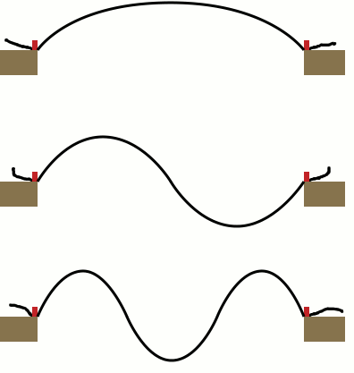
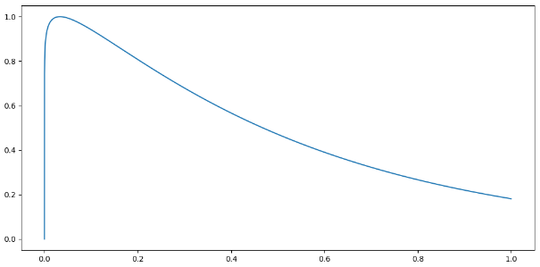
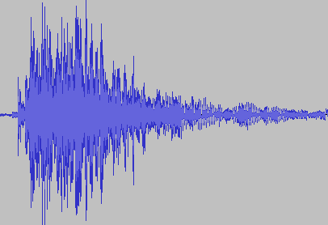

# Python编写钢琴乐曲
Ref: 21db文章: [《手把手教你用matlab编写乐曲》](https://mp.weixin.qq.com/s/feBaJGqX-qtw-KKsSCMzPQ)与《琴竟然是这样发声的》

## 琴弦的振动——和谐

琴弦的振动可以简化成一维模型，弦槌敲击琴弦后，琴弦进入自由振动状态。

假设琴弦是两端固定的（事实上不可能完全固定），且假设的时间内弦在击弦点处受到一个常力F的作用，其振动方程为：
$$
\frac{\partial^{2} u}{\partial t^{2}}-c^{2} \frac{\partial^{2} u}{\partial x^{2}}=F \Delta \cdot \frac{\delta(x-\alpha l)}{\mu}
$$
考虑到边界条件：
$$
\begin{array}{l}
\left.u\right|_{x=0}=\left.u\right|_{x=l}=0 \\
(0<x<l, t>0)
\end{array}
$$


得到琴弦振动的各阶频率为:
$$
f_{n}=\frac{n}{2 i} \sqrt{\frac{T}{\mu}}
$$
其中，i为弦长，T为弦的张力，μ为弦的线密度。当n=1时，f₁是弦振动最低的固有频率，也就是弦的基频，其余的高次频率称为泛频，它们都为基频的整数倍，因而也称具有这样简单关系的固有频率为谐频。弦振动时激发的固有频率都是谐频，所以弦乐器一般听起来音色都是和谐的。

## 包络生成函数

```
y=t^a/e^(kt)
```



